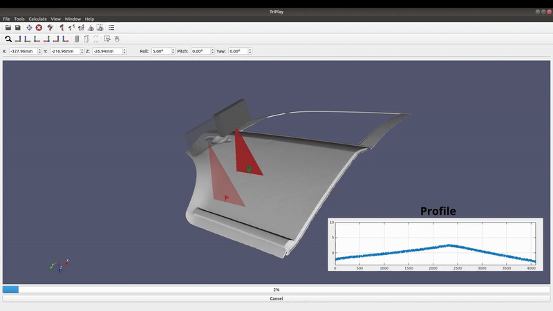

# Laser Triangulation Profilometric Sensor Simulator

## Description
This project is a simulator for laser triangulation profilometric sensors, designed to replicate real-world scanning conditions, including noise simulation (e.g., *speckle* noise using Perlin noise). The tool provides an environment to test and evaluate defect detection algorithms on industrial parts before deploying them in physical systems. 

## Features
- **Simulation of Laser Scanning:** Implements laser triangulation profilometric sensor modeling.
- **Speckle Noise Simulation:** Uses Perlin noise to introduce realistic *speckle* effects.
- **3D Surface Defect Simulation:** Supports defect modeling using Free-Form Deformation (FFD), enabling accurate replication of real-world defects.
- **Dataset Generation:** Creates labeled datasets of 3D scans for defect detection training and validation.
- **Inspection Path Optimization:** Includes tools for optimizing scanning paths to enhance inspection efficiency.

## Input Requirements
To use the simulator, the following inputs are required:
- **3D Model (STL format):** The part to be inspected.
- **Sensor Parameters:** Characteristics of the laser triangulation sensor.
- **Surface Roughness Details:** Defines the material and texture properties.
- **Defect Type:** Configurable defect types, including dents, peaks, and cracks.

| Dependencies           |
|------------------------|
| Qt                    |
| VTK                   |
| OpenCV                |
| OpenMP                |
| ROS                   |
| LAPACK & BLAS         |
| MPI                   |
| Mimmo                 |

## Reference

Roos-Hoefgeest, S., Roos-Hoefgeest, M., Álvarez, I., & González, R. C. (2023). "Simulation of Laser Profilometer Measurements in the Presence of Speckle Using Perlin Noise". *Sensors, 23*(17), 7624. [DOI: 10.3390/s23177624](https://www.mdpi.com/1424-8220/23/17/7624)

## Video of the experiments:

## Usage

This project is actively under development, and we are working on creating an executable version for easier use. Stay tuned for updates!
